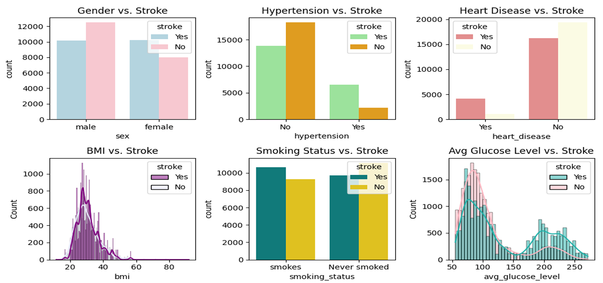
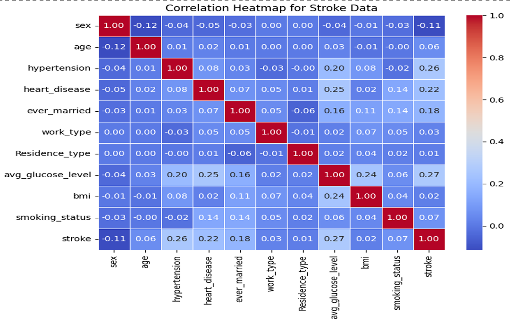
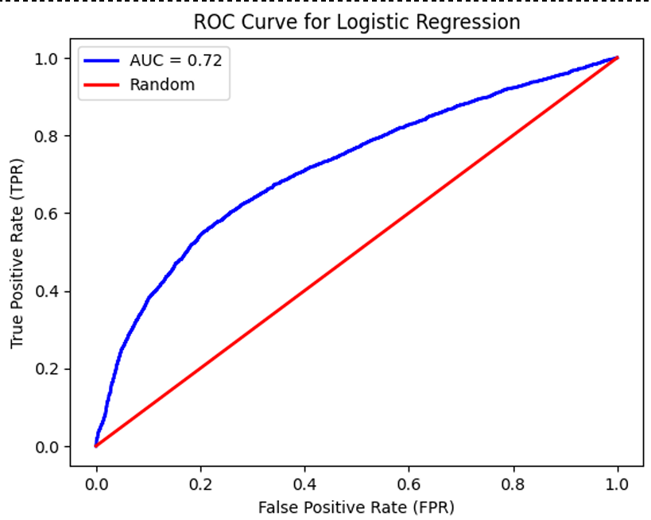
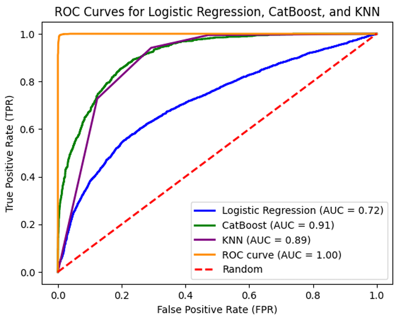

# Stroke Risk Prediction using Machine Learning

This project assesses the risk factors associated with stroke using data from the Behavioral Risk Factor Surveillance System (BRFSS) survey. By combining exploratory data analysis, statistical hypothesis testing, and multiple machine learning classification models, the study aims to identify significant predictors of stroke and evaluate model performance for accurate risk prediction.

---

## Introduction

Stroke is a leading cause of mortality and long-term disability worldwide. Using the 2015 BRFSS survey dataset, this project applies machine learning techniques to analyze and predict stroke risk based on demographic, clinical, and lifestyle factors. Previous studies have shown that modifiable factors such as hypertension, diabetes, obesity, and smoking significantly contribute to stroke-related morbidity and mortality.

The dataset includes key variables such as age, gender, BMI, smoking habits, physical activity, dietary choices, and medical history. The goal of this project is to derive actionable insights that can assist healthcare professionals, inform public health policies, and empower individuals to manage stroke risk effectively.

---

## Stroke Overview

### Definition
According to the World Health Organization (WHO), stroke is defined as a rapidly developed clinical sign of focal or global disturbance of cerebral function lasting more than 24 hours or leading to death, with no apparent cause other than vascular origin.

### Common Symptoms
- Sudden confusion or difficulty speaking
- Sudden numbness or weakness on one side of the body
- Sudden severe headache with no known cause
- Sudden vision problems
- Sudden difficulty walking, dizziness, or loss of balance

### Risk Factors
- High blood pressure
- Obesity
- Physical inactivity
- Poor diet
- Smoking
- Age and sex

---

## Aim and Purpose

### Aim
To investigate the impact of age, BMI, hypertension, smoking status, heart disease, and average glucose level on the risk of developing stroke.

### Purpose
This study seeks to uncover relationships between stroke occurrence and various demographic, clinical, and lifestyle factors. The findings aim to support healthcare providers, policymakers, and public health initiatives in developing targeted interventions for populations at risk, ultimately reducing the burden of stroke on individuals and society.

---

## Research Hypothesis

- **Null Hypothesis (H₀):** Sex, age, hypertension, heart disease, glucose level, BMI, and smoking are not associated with the risk of stroke.
- **Alternative Hypothesis (H₁):** Sex, age, hypertension, heart disease, glucose level, BMI, and smoking are associated with the risk of stroke.

---

## Dataset Description

- **Source:** BRFSS survey dataset (Kaggle)
- **Format:** CSV
- **Size:** 40,910 records × 11 variables
- **Target Variable:** Stroke (Yes / No)

### Data Types
**Categorical Variables**
- Gender
- Hypertension
- Smoking Status
- Heart Disease
- Ever Married
- Work Type
- Stroke

**Numerical Variables**
- Age
- BMI
- Average Glucose Level

---

## Methodology

### Data Collection
The dataset was obtained from Kaggle and originates from the BRFSS health survey.

### Data Cleaning and Preprocessing
- Loaded data using pandas
- Identified null values in the `gender` column and imputed them using the mode
- Dropped invalid negative values from the `age` column
- Converted numerical variables to categorical formats for visualization
- Assessed BMI outliers using box plots and applied **winsorization (5th–95th percentile)** to cap extreme values

---

### Descriptive Statistics
- Dataset contains 40,829–40,910 rows after cleaning
- 7 columns are categorical and 4 are numerical
- Gender distribution: 22,669 males and 18,182 females
- Smoking status: ~50% smokers and ~50% never-smokers
- Hypertension prevalence: 8,725 individuals
- Heart disease prevalence: 5,216 individuals

---

## Exploratory Data Analysis (EDA)

Visualizations were created to explore stroke prevalence across:
- Gender
- Hypertension status
- Heart disease
- BMI
- Smoking status
- Average glucose levels

EDA revealed a higher prevalence of stroke among individuals with hypertension, heart disease, smoking habits, and elevated glucose levels.

### Occurrence of Stroke by Risk Factors

---

## Correlation Analysis

A Pearson correlation matrix was generated to assess relationships between variables.

### Key Findings
- Strong positive correlations between stroke and:
  - Hypertension
  - Heart disease
  - Average glucose level
  - Smoking status
- Weak negative correlation between stroke and gender

### Correlation Heatmap

---

## Statistical Testing

### Chi-Square Test
Chi-square tests were conducted to evaluate associations between stroke and categorical variables.

- Gender vs Stroke: p ≪ 0.05 (highly significant)
- Hypertension vs Stroke: p < 0.05
- BMI vs Stroke: p < 0.05
- Average Glucose Level vs Stroke: p < 0.05
- Smoking Status vs Stroke: p < 0.05
- Heart Disease vs Stroke: p ≪ 0.05

**Result:** The null hypothesis was rejected for all tested variables, confirming significant associations with stroke occurrence.

---

## Machine Learning Models

### Data Preparation
- Stroke selected as the dependent variable
- Train–test split applied (80% training, 20% testing)
- Dataset found to be naturally balanced; therefore, **SMOTE was not applied** to preserve original distribution

---

### Classification Models Implemented
- Logistic Regression
- K-Nearest Neighbors (KNN)
- Random Forest
- CatBoost Classifier

Each model was evaluated using:
- Confusion matrix
- Accuracy
- Precision
- Recall
- F1-score
- ROC-AUC

---

## Results

### ROC Curve

### Model Performance Comparison

### Performance Summary

| Model               | Accuracy | Precision | Recall | F1 Score | AUC |
|---------------------|----------|-----------|--------|----------|-----|
| Random Forest       | 99%      | 100%      | 98%    | 99%      | 1.00 |
| CatBoost            | 82%      | 83%       | 80%    | 82%      | 0.91 |
| KNN                 | 84%      | 76%       | 94%    | 84%      | 0.89 |
| Logistic Regression | 67%      | 71%       | 58%    | 64%      | 0.72 |

Random Forest demonstrated superior performance across all evaluation metrics.

---

## Cross-Validation

Stratified k-fold cross-validation was performed to assess generalization and reduce overfitting.  
- Mean ROC-AUC: **0.9998**, indicating highly robust performance.

---

## Conclusion

- Stroke occurrence is significantly associated with age, gender, hypertension, heart disease, glucose level, BMI, and smoking status
- Machine learning models effectively captured complex relationships among risk factors
- Random Forest emerged as the most reliable and accurate model
- Results support the potential of ML-based tools for stroke risk assessment and public health decision-making

---

## Limitations

- Only one dataset was used due to lack of compatible identifiers for merging
- Minor inconsistencies were observed in age values within the dataset

---

## Code

- Full implementation is available in:
  - `IntroProject_26thNov.ipynb`
- The notebook includes:
  - Data preprocessing
  - Statistical testing
  - Visualization
  - Model training and evaluation
